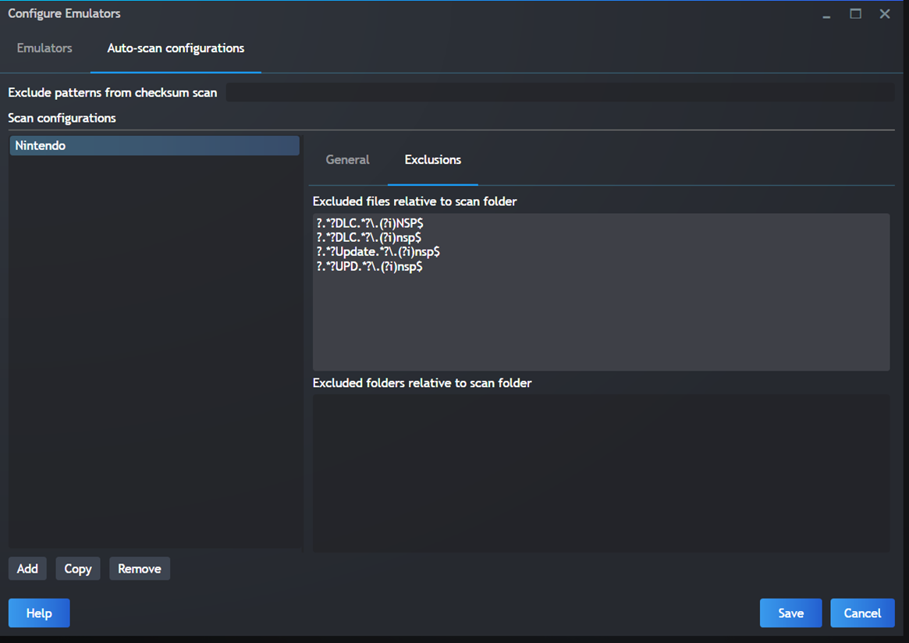
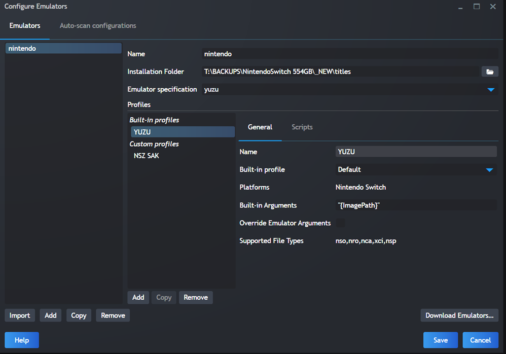
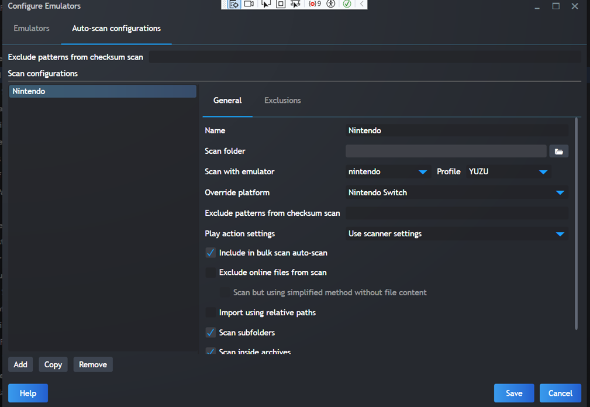
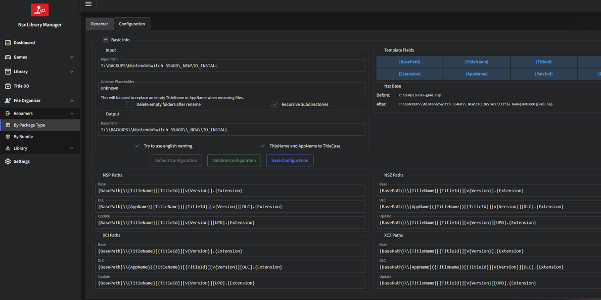
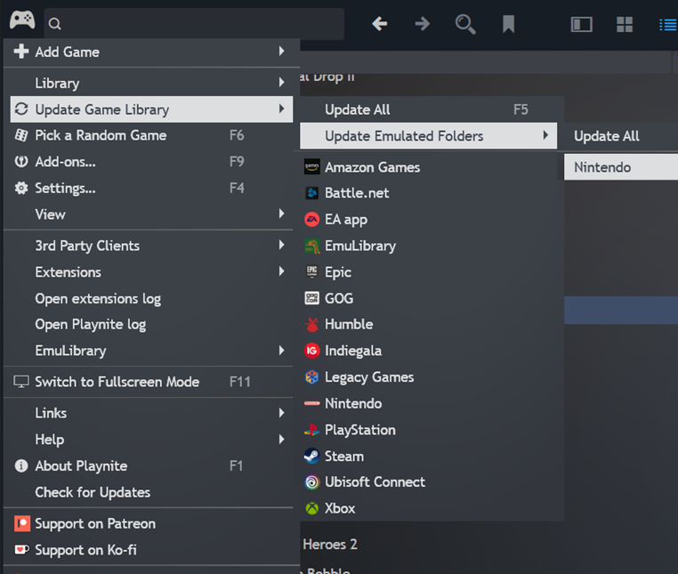

# How to import .NSP files in Playnite

## Contents
1. [Configure an emulator](#1-configure-an-emulator)
2. [Rename your files to match that pattern](#2-rename-your-files-to-match-that-pattern)
3. [Update Emulated Folders](#3-update-emulated-folders)

## 1. Configure an emulator

In Playnite, first you will need to configure an emulator.

To start, press **CTRL-T**

Then you can use **Exclusions** in **Auto-scan configurations**. You need to enter these regular expressions:

```
?.*?DLC.*?\.(?i)NSP$
?.*?Update.*?\.(?i)nsp$
?.*?UPD.*?\.(?i)nsp$
```

> **Note:** When using regex, make sure it starts with a question mark or at least refer to the 4 modes listed here (I spent half an hour figuring out why my regex was not working):
> https://api.playnite.link/docs/master/manual/features/emulationSupport/addingEmulatedGames.html



Your configuration should look like the screenshots in the `.docx` version, but you will have to specify your own **Installation Folder** (where your ROMs are) and your own **Scan Folder**.



Same with your own Scan Folder:



## 2. Rename your files to match that pattern

There are a few tools:

### My own tools (recommended)
- **One file at a time:** https://github.com/tetj/4NXCI-2026
- **Convert all:** https://github.com/tetj/ConvertXciToNsp

### Nsx Library Manager

This is the only tool I found that is able to get the TITLE_ID from the NSP file content. It's also the only one still maintained, so it's pretty cool when you have files like `lfc-a85da.nsp`.

There are 2 small issues with this tool:
- **No way to keep files in their current folder** — I would like to keep my folder structure.
  - *Solution:* it's developed in C# so I might fork it and add an option on `PackageRenamer.razor.cs`
- **Even when filtered to show only NSP files, it still renamed my XCIs**, which I wanted to exclude. XCIs are "specials" since they contain both base file, updates and DLCs. I prefer not to rename them since the resulting filename does not match the content.
  - *Solution:* I might end up writing a small program which will call `4nxci.exe` to convert `.xci` files to `.nsp`. By having everything as NSP, it would make it easier to manage/organize. The other problem is that 4nxci is extremely slow.

**File name format I use:**

| Type   | Template |
|--------|----------|
| Base   | `{BasePath}\\{TitleName}[{TitleId}][v{Version}].{Extension}` |
| DLC    | `{BasePath}\\{AppName}({TitleName})[{TitleId}][v{Version}][DLC].{Extension}` |
| Update | `{BasePath}\\{TitleName}[{TitleId}][v{Version}][UPD].{Extension}` |



### Switch-Library-Manager 1.4.0

Your `settings.json` file should look like this (at least that portion):

```json
"organize_options": {
  "create_folder_per_game": false,
  "rename_files": true,
  "delete_empty_folders": false,
  "delete_old_update_files": false,
  "folder_name_template": "{TITLE_NAME}",
  "switch_safe_file_names": true,
  "file_name_template": "{TITLE_NAME}({DLC_NAME})[{TITLE_ID}][v{VERSION}][{TYPE}]"
}
```

You must first click **Rescan** your folder, then click on **Organize files**.

> **Warning:** I recommend testing it in a subfolder before trying it on your whole library.

### Nut

To rename your files to match that pattern, you can use [nut](https://github.com/blawar/nut). There is a feature to **Organize Files**, but it's probably best to take a backup of your folder first because you might not like how it will be organized.

### DBI

If nothing works, you can also use `DBI.nro` to copy your NSPs (using MTP) from your Switch to your PC. DBI uses the same pattern as the 2 regexes above.

> **Note:** nut does not include the keyword "Update", so instead you could ignore anything that does not include `v0`. However, some games use `[v65536][Base]` instead of `[v0][Base]`.

### NxFileViewer

https://github.com/Myster-Tee/NxFileViewer → Tools → Renaming tool (F2)

**Syntax:**
```
{WAppTitle}[{TitleId:U}][v{PatchNum}].{Ext:L}
{WAppTitle}[{TitleId:U}][v{VerNum}][UPD].{Ext:L}
{WAppTitle} - {WTitle} [{TitleId:U}][v{VerNum}][DLC].{Ext:L}
```

Supports: `*.nsp`, `*.nsz`, `*.xci`, `*.xcz`

## 3. Update Emulated Folders

After renaming your files, update your emulated folders in Playnite so the library scanner picks up the renamed ROMs.

